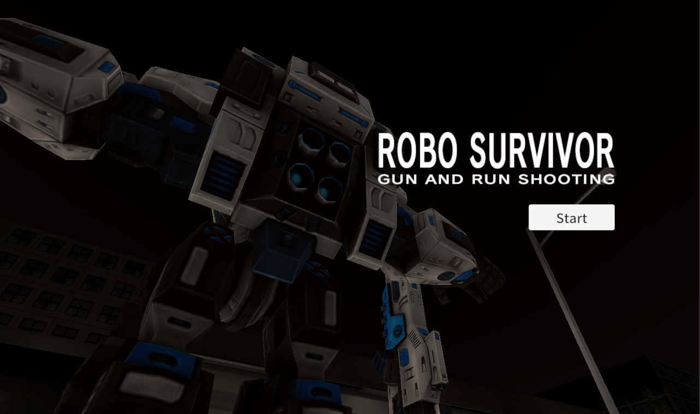

# RoboSurvivor
## RoboSurvivorについて
廃墟となった暗闇の町で、敵ロボットと戦いながらロボットジェネレーターを全て破壊する。
最後に現れるボスキャラを倒し敵を殲滅する3Dバトルアクションゲーム。
  

## ゲームプレイ方法
[ゲームのサンプルプレイ](https://github.com/hoshino-moz/RoboSurvivor)

  
### 操作方法
* Aキー（左キー）：左に移動
* Dキー（右キー）：右に移動
* スペースキー：ジャンプ
* マウス操作：視点を回転 シュートの照準
* マウス左クリック：シュート
* マウス右クリック：ソード
### ゲームルール
* 敵とぶつかってPlayerのHPがゼロになったらゲームオーバー
* 
  　
## 使用技術
* ゲームエンジン：Unity6
* 使用言語：C#
* 使用ツール：VisualStudio、

## 開発の工夫
* 開発期間：20時間
* 担当範囲：Player担当　動き、アニメーション、状態遷移など作成
* こだわった点：

* 技術的な調整：

### スクリプトの詳細
* PlayerController.cs  
